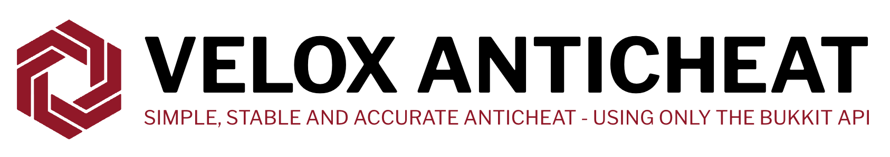

 
&nbsp;
&nbsp;
&nbsp;

# About
The goal of Velox is to create a simple and accurate anticheat, based on only the tools made available by Bukkit/Spigot. 
This means no external libraries, no reflection and no NMS. Why? Because why not (there are many reasons why).

**As of now (30/12/2021) this plugin is not release-ready and you should not be using it in a production environment.**

# Issue Reporting
Issues or bugs should be files by hitting the [issues](https://github.com/Rammelkast/VeloxAnticheat/issues) tab above. Please make sure you search your issue before opening a new one.

Please include the following information with your issue:
+ Your version of Velox Anticheat
+ Your server implementation (Spigot, etc.) and it's version
+ Whether or not you are using protocol hacks (ViaVersion etc.)
+ Any logs, videos or screenshots relating to the issue

# License
Velox Anticheat is licensed under the [GPL-3.0](https://github.com/Rammelkast/VeloxAnticheat/blob/master/LICENSE) license.
